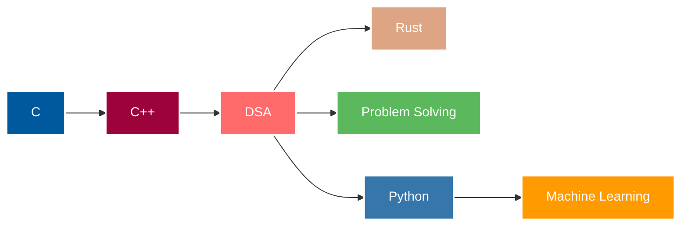

<div align="center">
  
# ✨ Hello, I'm Vaibhav ✨

[](https://git.io/typing-svg)

_Where code meets creativity and curiosity_


</div>

## 💻 Tech Stack

<div align="center">


</div>

<div align="center">
  
[](https://git.io/streak-stats)

</div>

## 👨‍💻 About Me

```C
struct Skills {
    const char* languages[5];
    const char* learning[2];
    const char* tools[3];
};

struct VaibhavProfile {
    const char* current_focus;
    const char* interests[4];
    struct Skills skills;
    const char* challenge;
    const char* motto;
};

int main() {
    struct VaibhavProfile vaibhav = {
        .current_focus = "Data Structures & Algorithms",
        .interests = {
            "Systems Programming",
            "Problem Solving",
            "Machine Learning",
            "Open Source"
        },
        .skills = {
            .languages = {"C", "C++", "Rust", "HTML", "CSS"},
            .learning = {"Python 🐍", "Machine Learning 🤖"},
            .tools = {"Git", "VSCode", "Linux"}
        },
        .challenge = "Becoming proficient in Python and ML techniques",
        .motto = "Every line of code is an adventure"
    };

    // Life mission: Solving complex problems with elegant solutions
    return 0;
}
```

> 🌟 **Problem solving enthusiast:** I love tackling algorithmic challenges and finding elegant solutions to complex problems!

## 🔮 Spells In My Grimoire

<table>
  <tr>
    <td align="center"></td>
    <td align="center"></td>
    <td align="center"></td>
    <td align="center"></td>
    <td align="center"></td>
    <td align="center"></td>
  </tr>
  <tr>
    <td align="center">C++</td>
    <td align="center">C</td>
    <td align="center">Rust</td>
    <td align="center">HTML</td>
    <td align="center">CSS</td>
    <td align="center">Python 🪄</td>
  </tr>
</table>


## 📊 GitHub Stats

<div align="center">
  
  
</div>

## 🌐 Connect With Me

<div align="center">
  
[](mailto:necromancer44@proton.me)
[](mailto:t53aru74l@mozmail.com)
[](https://github.com/VAibhav1031)

</div>


## 📚 Learning Journey

<div align="center">
  


</div>

## 💬 Collaboration

I believe in the power of collaboration and community. Let's connect and create something amazing together! Whether it's solving challenging problems, contributing to open source, or building something new, I'm always excited about opportunities to work with fellow developers.

## 🧠 Problem Solving Approach

<div align="center">

```
function solveProblems(problem) {
  1. Understand the problem thoroughly
  2. Break it down into smaller components
  3. Consider multiple approaches
  4. Implement the most efficient solution
  5. Test with various edge cases
  6. Optimize for readability and performance
}
```

</div>

## 🌌 Fun Fact

<div align="center">
  
> "Coding is like solving puzzles; each bug is a mystery waiting to be solved, and each solution is a small victory! ✨"

</div>

<div align="center">
  
## 🎉 Thanks for Stopping By!


_"Keep coding, stay curious, and never stop solving problems!"_

</div>
